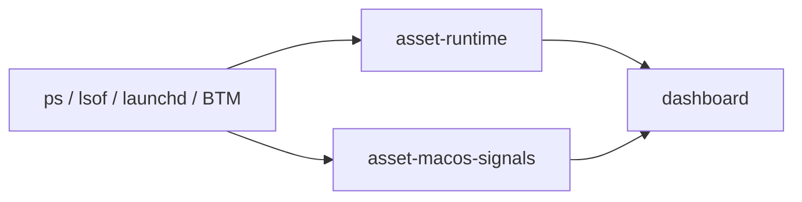
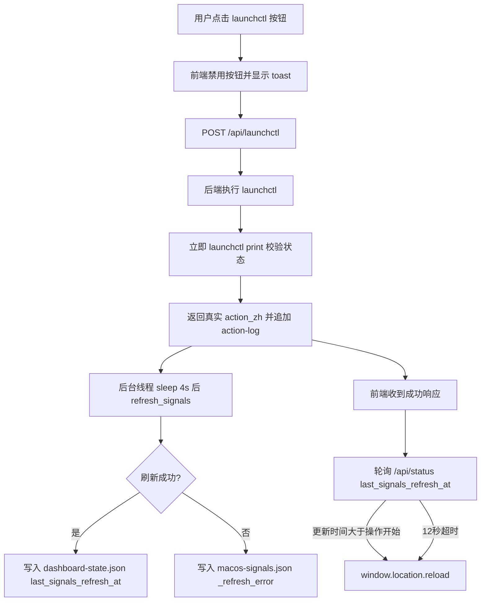

# Agent Assets Control Plane — 产品需求文档（PRD）

## 1. 产品定位

**Agent Assets Control Plane** 是面向本机 AI Agent 生态的「运行态观测台」。

它不是把所有工具搬进同一个目录，也不是要求用户预先维护一份完美台账；
而是帮助用户和 Agent 看清「现在本机到底在跑什么、有没有泄漏、有没有僵尸服务、
哪些程序在监听端口」。

## 2. 目标用户与场景

- **本机运行多个 Agent / MCP / 开发服务器的人**：工具分散在 npm、uv、pip、Homebrew、
  手工 clone 等各处，时间一长不知道后台在跑什么。
- **频繁切换 Agent host 的人**：Claude、Cursor、WorkBuddy、自定义项目各自引用不同的 MCP，
  容易出现同一个 MCP 被多个 host 重复拉起。
- **希望新 Agent 快速了解本机环境的人**：通过 `~/AGENT_START_HERE.md` 和 registry 快照，
  新 Agent 不需要反复问用户「X 装在哪」。

## 3. 核心问题

1. **预登记必然脱节**：工具流动太快，手动维护 registry 很快和实际环境不一致。
2. **运行态是盲区**：进程泄漏、僵尸 dev server、常驻 daemon、端口占用，人和 Agent 都看不清。
3. **分类标准混乱**：原来的 registry 用一个 `category` 字段同时表达类型、形态、功能，
   导致同一个资产标签不统一。

## 4. 设计原则

- **运行态优先**：核心能力是只读扫描，不是强制登记。
- **按需扫描**：跑一次、照一次快照，过时就重扫，不依赖维护纪律。
- **只读观测**：runtime / macos-signals 不写入 registry，不杀进程，不动系统文件。
- **8 分类模型**：每个资产只有一个主类型，形态标签作为补充。
- **localhost only**：dashboard 只绑 `127.0.0.1`，不暴露公网。

## 5. 产品模块

| 模块 | 入口 | 职责 |
|---|---|---|
| Dashboard | `agent-assets-dashboard` | 静态 HTML / 本地 HTTP 服务，展示资产、MCP、runtime、系统信号 |
| Runtime 观测 | `asset-runtime` | 进程语义分类：MCP 泄漏、僵尸 dev server、常驻 daemon、端口占用 |
| macOS Signals | `asset-macos-signals` | launchd / BTM / 登录项 / 系统扩展 / 端口监听全景 |
| 磁盘发现 | `agent-assets-discover` | 扫描潜在 CLI / MCP / Agent 候选入口 |
| 项目索引 | `agent-assets-projects` | 索引 `~/projects` 及其他根目录下的项目 |
| 登记（可选） | `agent-assets-register` | 手动把候选写入 registry，已退役为可选能力 |
| 列表 | `agent-assets-list` | 打印 registry 内容 |

## 6. 数据流

### 6.1 Contract 链（可写，历史快照）

### 6.2 Runtime 观测旁路（只读，不进 registry）

## 8. 迭代：launchctl 操作刷新可靠性与系统信号 UI 优化

### 8.1 背景

系统信号 tab 允许用户直接对 LaunchAgent 执行启动、停止、启用自启、禁用自启。但 launchctl 是异步生效的，后台完整刷新需要约 4 秒；前端旧的 `window.location.reload()` 在请求返回后立即刷新，导致用户经常看到旧状态，反馈「点了没反应」。同时，系统信号表格的「关联」列直接渲染所有 `linked_assets` chip，长标识符（如 `agent-assets-system:stable_entrypoints`）会把行撑得很高，视觉混乱。

### 8.2 需求

1. **操作后状态必须可靠同步**：
   - 后端执行 launchctl 后立即用 `launchctl print` 做一次快速状态校验，得到真实的 running / disabled 状态。
   - 用这个真实状态修正返回给前端的 `action_zh`。
   - 保留后台异步完整刷新（约 4 秒后重跑 `agent-assets-macos-signals` 并重写 `dashboard.html`），但失败时把错误写入 `macos-signals.json` 的 `_refresh_error` 字段，成功时写入 `last_signals_refresh_at` 时间戳到 `~/.config/agent-assets/dashboard-state.json`。
2. **前端轮询等待刷新完成**：
   - 点击 launchctl 按钮后禁用按钮并显示 toast「操作中...」。
   - 请求 `/api/launchctl` 成功后显示 toast「操作成功，正在刷新状态...」。
   - 轮询 `/api/status` 检查 `last_signals_refresh_at`，最多等待 12 秒，检测到更新后再 reload。
   - 失败时显示具体错误并恢复按钮。
3. **系统信号「关联」列清爽化**：
   - 最多显示 1 个 chip；超过 1 个时显示为「首个 chip + `+N`」badge。
   - hover 时用 `title` 展示完整列表。
   - 无关联显示「未关联」。
4. **表格布局优化**：名称、资源、端口、操作列保持单行，避免 chip 或「自启·已启用/已禁用」span 撑高行。

### 8.3 数据流

### 8.4 涉及文件

- `lib/agent_assets_dashboard_api.py`：快速状态校验、后台刷新错误/时间戳处理。
- `lib/agent_assets_dashboard_html.py`：前端轮询 JS、表格 CSS、`/api/status` summary 增加时间戳字段。
- `lib/agent_assets_dashboard_render.py`：关联列截断渲染、自启状态紧凑样式。
- `lib/agent_assets_dashboard_paths.py`：新增 `DASHBOARD_STATE` 路径常量。
- `tests/test_dashboard_api.py`：新增 launchctl 状态映射与刷新错误处理测试。
- `tests/test_dashboard_render.py`：新增关联列截断测试。

## 7. 8 分类模型

每资产只有一个主类型，形态标签可选：

| 主类型 | 判定 | 例子 |
|---|---|---|
| agent | 能自主对话、干活的 AI 主体 | claude-code、Cursor、Alice |
| mcp | MCP 服务 | context7、gbrain、wechat-mcp |
| cli-tool | 命令行工具（不是 agent） | git、rg、asset-runtime |
| skill | 技能包 / skill 目录 | Claude skill 目录 |
| project | 项目 / 工作区 | `~/projects/xxx` |
| config | 规则 / 契约文件 | `AGENT_CONTRACT.md`、registry |
| support | 运行时 / 支撑设施 | python、包管理器、launchd |
| unsorted | 临时区，等待人工标记 | 规则分不清时先放这里 |

## 8. 验收标准

- [x] `asset-runtime` 能在终端输出 leak / zombie / daemon 分类报告，并提供 `--json`。
- [x] `asset-macos-signals` 能生成 `macos-signals.json`，列出 launchd / BTM / 登录项。
- [x] dashboard 能渲染资产分组、MCP audit、runtime、系统信号四个视图。
- [x] dashboard 支持一键扫描、review 决策、launchctl 开关、runtime 进程终止。
- [x] 新增 host 时只需修改 registry 或环境变量，不需要改代码。
- [x] 核心函数有单元测试覆盖，smoke test 通过。

## 9. 非目标

- 不替代包管理器，不移动 Homebrew / npm / pip 内部文件。
- 不做远程监控，dashboard 仅本机访问。
- 不自动清理或删除任何系统文件 / 进程；只提供信息和可控操作。
